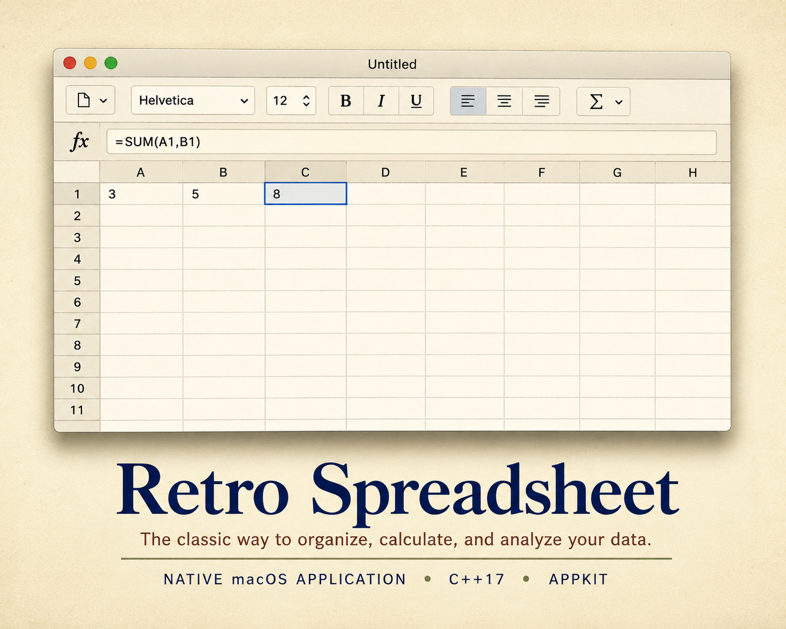

# Retro Spreadsheet

<p align="center">
  
</p>

<p align="center">


</p>

A native macOS spreadsheet built with modern C++ and AppKit.

This project explores **Agentic Software Engineering** by using modern AI coding agents to collaboratively design, implement, test, and evolve a real desktop application over time.

---

## Features

- Native macOS AppKit interface
- Formula bar and spreadsheet formulas
- Cell formatting
- Row and column selection
- Copy, cut, and paste
- Undo and redo
- CSV import and export
- Native document support
- Automated testing

---

## Build

```bash
cmake -S . -B build -DCMAKE_BUILD_TYPE=Debug
cmake --build build --parallel
```

---

## Testing

Run the portable test suite:

```bash
ctest --test-dir build --label-exclude 'ui|local'
```

Run all local tests, including AppKit UI validation:

```bash
ctest --test-dir build
```

Linux CI runs only the portable engine tests. Native AppKit UI tests are executed locally on macOS.

